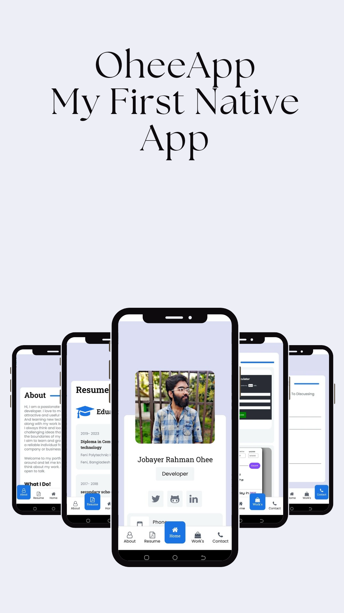

# OheeApp

This is just a poractive app. I didnt learnet any code for make this app. All i did was used my old knowledges in mernstack and searched on googl how to install thee projects and also searched for appropiate libraries to use in different sectors. This is my first project and I will gradually Update it in th future I am planning to make this a fullstack application lets see how far I can go.

### Used technology:
- Expo
- React Native
- nativeWind
- react-native-safe-area-context
- react-native vector icons

Okay, the app is complete. So far I have learned a lot of things. Obviously, I didn't add everything here. but I think it is a pretty reasonable app. First of all, it has a beautiful layout design. I learned tabs (Which is a navigation method), fetching data, using Flatlist, Alert, Modals, and RefreshControl. Right now I don't have any idea what I should add to it. So It is complete for right now.